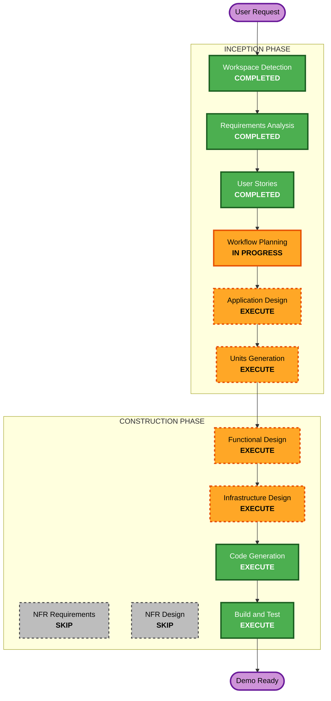

# Execution Plan

## Detailed Analysis Summary

### Transformation Scope
- **Transformation Type**: Greenfield - Full system build
- **Primary Changes**: Entire RMS platform (frontend, backend, infrastructure, AI services)
- **Related Components**: 10+ AWS services, 4 user portals, 5 integration endpoints

### Change Impact Assessment
- **User-facing changes**: Yes - 4 role-based UIs (Admin, Archives Staff, Records Officer, Agency Portal)
- **Structural changes**: Yes - New multi-tier cloud architecture
- **Data model changes**: Yes - Complete PostgreSQL schema (records, locations, transmittals, dispositions, users)
- **API changes**: Yes - Full REST API (~40+ endpoints)
- **NFR impact**: Yes - Security (AES-256, RBAC, MFA), Performance, DR (multi-region)

### Risk Assessment
- **Risk Level**: Medium (demo context - no production data at risk)
- **Rollback Complexity**: Easy (greenfield, can redeploy from scratch)
- **Testing Complexity**: Moderate (multiple integrations, AI services, role-based access)

## Workflow Visualization



## Phases to Execute

### INCEPTION PHASE
- [x] Workspace Detection (COMPLETED)
- [x] Reverse Engineering (SKIPPED - greenfield)
- [x] Requirements Analysis (COMPLETED)
- [x] User Stories (COMPLETED)
- [x] Workflow Planning (IN PROGRESS)
- [ ] Application Design - **EXECUTE**
  - **Rationale**: New system needs component architecture, service definitions, API contracts, and data model design before code generation
- [ ] Units Generation - **EXECUTE**
  - **Rationale**: System is large (12 epics, 26 stories). Decompose into parallel work units for structured code generation

### CONSTRUCTION PHASE (Per-Unit)
- [ ] Functional Design - **EXECUTE**
  - **Rationale**: Complex data models (records, locations, transmittals, dispositions), business rules (retention schedules, legal holds, multi-level approvals), and workflow state machines need formal design
- [ ] NFR Requirements - **SKIP**
  - **Rationale**: NFRs already defined in requirements doc (Section NFR-01 through NFR-04). RFP proposal specifies the exact AWS services. No ambiguity to resolve.
- [ ] NFR Design - **SKIP**
  - **Rationale**: NFR implementation patterns are well-established AWS patterns (KMS encryption, Cognito MFA, multi-region S3). Reference repos provide proven CDK patterns. No novel NFR design needed.
- [ ] Infrastructure Design - **EXECUTE**
  - **Rationale**: Full AWS infrastructure needs specification — VPC layout, CDK stack decomposition, service configuration, cross-region replication setup
- [ ] Code Generation - **EXECUTE** (ALWAYS)
  - **Rationale**: All application code, CDK infrastructure, frontend, seed data
- [ ] Build and Test - **EXECUTE** (ALWAYS)
  - **Rationale**: Build instructions, deployment steps, test scripts

### OPERATIONS PHASE
- [ ] Operations - PLACEHOLDER

## Proposed Work Units

Based on the system decomposition, I recommend **5 units** for Construction:

| Unit | Name | Scope | Priority |
|------|------|-------|----------|
| 1 | **Infrastructure & Auth** | CDK stacks (VPC, RDS, S3, Cognito, ECS, OpenSearch), RBAC, MFA | P0 - Foundation |
| 2 | **Core Records API** | Records CRUD, classification, retention, templates, barcode generation, PostgreSQL schema | P0 - Core |
| 3 | **Workflows & Inventory** | Transmittals, dispositions, legal holds, warehouse locations, circulation tracking | P1 - Workflows |
| 4 | **Search & AI** | OpenSearch indexing, Textract OCR pipeline, Bedrock semantic search & classification | P1 - Intelligence |
| 5 | **Frontend & Portal** | React app (Admin UI, Archives Staff UI, Agency Self-Service Portal), dashboards, reports | P0 - Visible |

### Build Sequence (Dependencies)

```
Unit 1: Infrastructure & Auth
    |
    +---> Unit 2: Core Records API (needs DB, S3, Cognito)
    |         |
    |         +---> Unit 3: Workflows & Inventory (needs Records API)
    |         |
    |         +---> Unit 4: Search & AI (needs Records in DB/S3)
    |
    +---> Unit 5: Frontend & Portal (needs API contracts from Unit 2)
              |
              +---> Integration with Units 3, 4 (after APIs ready)
```

## Estimated Timeline
- **Total Stages**: 8 (remaining after this stage)
- **Application Design**: ~1 session
- **Units Generation**: ~1 session  
- **Functional Design** (per unit): ~1 session each
- **Infrastructure Design**: ~1 session
- **Code Generation** (per unit): ~2-3 sessions each
- **Build and Test**: ~1 session
- **Target**: Demo-ready by end of week

## Success Criteria
- **Primary Goal**: Fully functional demo showcasing all 14 functional requirements for State of Maine evaluators
- **Key Deliverables**:
  - Deployed AWS infrastructure (michael-primary account)
  - Working web application with 4 role-based views
  - Real AI services (Textract OCR, Bedrock classification/search)
  - Realistic synthetic data (Maine State Archives context)
  - Barcode generation and scanning support
  - Real-time analytics dashboard
- **Quality Gates**:
  - All user stories from P0 and P1 demonstrable
  - Role-based access enforced
  - Audit trail captures all actions
  - WCAG 2.1 AA basics (keyboard nav, contrast, screen reader labels)
